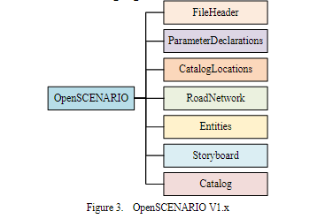
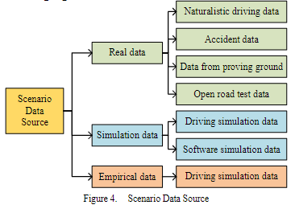

# A Survey of Autonomous Driving Scenarios and Scenario Databases

[PDF](/reference_summary/A_Survey_of_Autonomous_Driving_Scenarios_and_Scenario_Databases.pdf)

keywords : autonomous driving scenarios, scenario dataset, scenario database, scenario description

## Abstract 
  - 요약 :  *this paper sumarizes the research progress of autonomous driving scenarios and scenario databases*
  - 모르는 단어
    - comprehensive : complete and including everything that is necessary
    - connotation : something suggested by an object or situation
    - perspective : a particular way of considering something.

## Introduction 
  - 요약 :   이번 페이퍼는 다음과 같은 관점으로 autonomous driving scenario와 scenario databases를 정리했다. (autonomous driving scenario / scenario description standard / scenario dataset / scenario database / summary and prospect)
  - 모르는 단어
    - criterion : a standard by which you judge, decide about, or deal with something.
    - significance : importance

## SCENARIO IN AUTONOMOUS DRIVING
  - A. Scenario Definition 요약 :   *scenario describes the external roads, traffic facilities, weather and traffic participants as well as the driving tasks and states of the vehicle itself. It is an organic combination and comprehensive reflection of the driving environment, traffic participants and driving behavior within a certain time and space, and it will change dynamically.*
  - B. Scenario Elements and Layered Model 요약 :   *Scenario is a combination of various scenario elements in a certain time and space, and there is a strong coupling relationship between them*
    - divide by perspective of autonomous driving test requirements : environmental elements, traffic participant elements, self-vehicle tasks
    - divide by basic attributes of scenario elements : static elements, dynamic elements
    - divide by topological relationship of scenario elements : road elements, traffic participant elements, meteorological elements, network elements
    - six - layer model by PEGASUS project   L1 Road layer : Road topology, pavement quality, pavement boundaries, etc   L2 Traffic infrastructure layer : Structural boundaries, traffic signs, signal lights, etc   L3 Temporary manipulation layer of L1 and L2 : Temporary facilities on roads, such as temporary road closures, road construction sites, etc   L4 Objects layer : Traffic participants, and the status, behavior, etc. of traffic participants   L5 : Environment layer : Weather, electromagnetic strength, temperature, etc.   L6 Data communication layer : V2X information, digital map information, etc.
  - 모르는 단어
    - premise : an idea or theory on which a statement or action is based
    - omit : to fail to include or do something
    - temporal : relating to practical matters or physical things, rather than spiritual ones.
    - manoeuvre : a movement or set of movements needing skill and care
    - comprehensive : complete and including everything that is necessary
    - dimensionality : the quality of having or appearing to have height, length, and width rather than being flat
    - extent : the degree or limit of something
    - connotation : a feeling or idea that is suggested by a particular word although it need not be a part of the word's meaning, or something suggested by an boject or situation
    - pavement : sidewalk
    - constrain : to control and limit something
    - V2X : 자동차가 다른 모든것과 연결하는 기술
    - constitute : to be or be considered as something
    - meteorological : relating to weather conditions
    - topological : 위상적으로???

## SCENARION DESCRIPTION STANDARD
  - A. ASAM OpenX Standards 요약 :      *In ASAM OpenX, OpenSCENARIO describes dynamic content, OpenDRIVE describes the road network for static content, and OpenCRG describes the road network for static content. The three standards complement each other and cover both static and dynamic aspects of autonomous vehicle simulation applications.*
  - B. OpenDRIVE 요약 :   *The OpenDRIVE description format contains all static objects of a road network that allow realistic simulation of vehicles driving on roads.*
  - C. OpenSCENARIO 요약 :      *OpenSCENARIO defines a file format for the description of the dynamic content of driving and traffic simulators.*
  - 모르는 단어
    - calibration : the units of measurement marked on an instrument so that it can measure accurately
    - parsing : to examine computer data and change it into a form that can be easily read or understood
## SCENARIO DATASET
  - 요약 :     > Naturalistic driving data : *Naturalistic driving data contains very rich scenario information, which can truly reflect the traffic operation state when traffic conditions occur.*  > Accident data : *Accident data is a typical safety test condition, which can test the stress ability of the automatic driving system*  > Data from proving ground : 여러 테스트를 목적으로 한 자율주행차 테스트 환경 (ex: 한국의 K-city)등에서 수집된 시나리오들  > Open road test data : *The open road test data refers to the scenario elements collected during self-driving vehicles are tested on the open roads.*  > Driving simulation data : *Scenario element information obtained by using the driving simulator to test*  > Software simulation data : *By artificially setting the driving task or driving route, the test vehicle is driven in the virtual simulation scenario, so as to generate the simulation data.* 
  - 모르는 단어 : 
    - empirical : based on what is experienced or seen rather than on theory
    - scarce : not easy to find or get
    - authenticity : the quality of being real or true

## SCENARIO DATABASE
  - 요약 :   *The autonomous driving scenario database is a data collection of different scenarios, which is expressed in the form of a database.*   다양한 데이터베이스들이 있다. 이 논문은 중국에서 나온 논문이기에 중국에서 만들어진 데이터베이스들을 소개하고 있다.

## SUMMARY AND PROSPECT
  - 요약 :   > *OpenSCENARIO V2.0 needs to be further verified, and the comprehensiveness of the dynamic scenario description method needs to be further improved.*   >*In the future, it is necessary to conduct research on mining unknown scenarios to improve the reliability and safety of autonomous driving tests.*   >*the richness, diversity and effectiveness of the scenario database all require the joint efforts of research developers.*   >*requires the joint advancement of researchers in multiple fields.*
  - 모르는 단어
    - inconsistent : If a reason, idea, opinion, etc. is inconsistent, different parts of it do not agree, or it does not agree with something else.
    - comprehensive: complete and including everything that is necessary
