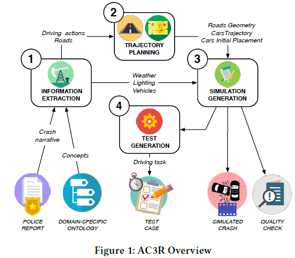
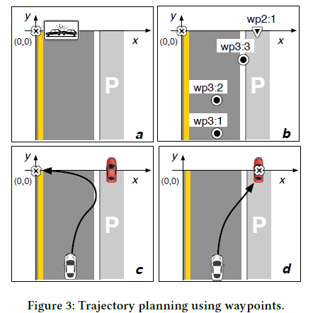

# Summary of generating_effective_test_cases_for_self_driving_cars_from_police_reports

## ABSTRACT

- chatgpt 번역에서 따온 중요하다 생각하는 문장
  - 실제 차량 사고에서 수집된 감각 데이터가 부족하여 전체 재현이 불가능하기 때문에, 우리는 이러한 사고를 기록한 경찰 보고서에서 정보를 추출하여 재현합니다.
  - 비상 경행 시나리오를 구현하는 테스트와 비교하여, 우리의 테스트는 테스트 대상을 다양한 방식으로 압박하며 구현의 몇 가지 결점을 드러내는 효과적인 결과를 가져왔습니다.

## CCS CONCEPT

- Software and its engineering &rarr; Virtual worlds training simulations
- Software verification and validation

## KEYWORDS

- automatic test generation, natural language processing, procedural content generation, self-driving cars

## INTRODUCTION

- chatgpt 번역에서 따론 중요한 문장
  - 가장 좋은 테스트 시나리오는 무엇이며, 어떻게 체계적으로 생성할 것인지는 주요한 공개적인 문제입니다.
  - 자율 주행차를 테스트하기 위한 관련 테스트 케이스를 효율적으로 생성하기 위한 혁신적인 접근 방식인 AC3R (자동 사고 생성기)를 제안합니다.
  - 그러나 실제 사고 중 자동차에서 수집된 자세한 감각 데이터는 보통 충분히 상세하지 않아 전체 재현이 어렵습니다. 따라서, AC3R은 다른 전략을 채택하여, 차량 사고를 재현하기 위해 이들을 기록한 경찰 보고서에서 정보를 추출합니다.
  - 따라서 AC3R은 자연어 처리(Natural Language Processing, NLP) 기술과 도메인 특화 온톨로지(domain-specific ontology)를 결합하여, 경찰 보고서에서 관련 정보를 추출하고, 차량 사고의 역학을 재구성하며, 차량 사고를 컴퓨터 시뮬레이션으로 재현하는 코드를 자동으로 생성하여 테스트 케이스로 사용합니다.
  - 이 논문의 기여는 다음과 같습니다. - 우리는 자동으로 재구성된 차량 사고를 사용하여 자율주행 차량 소프트웨어를 테스트하는 최초의 AC3R 접근 방법을 제시합니다. - 34명의 참가자를 대상으로한 실험적 사용자 연구를 통해 재구성된 차량 사고의 정확성을 평가합니다. - 최신 비전 기반 자율주행 차량 소프트웨어 시스템을 테스트하여 생성된 테스트 케이스의 품질을 평가합니다.
  - 우리의 연구를 재현하고 이 주제에 대한 추가 연구를 가능하게 하기 위해, 우리는 AC3R의 소스 코드, 평가 데이터 및 실험 재현 지침을 다음 주소에서 공개합니다 : https://github.com/SoftLegend/AC3R-Demo

## AUTOMATICALLY RECONSTRUCTING AND SIMULATING REAL CAR CRASHED

- chatgpt 번역에서 따온 중요한 문장
  - AC3R는 경찰 보고서에서 재구성된 자동차 충돌 사고로부터 시뮬레이션 기반 테스트를 도출하기 위해 네 단계적인 접근 방식을 채택합니다 (그림 1):
    - Information Extraction: AC3R은 NLP를 활용하여 경찰 보고서에서 사고 원인과 관련된 정보를 추출하고, 도메인 특화 온톨로지를 활용하여 텍스트의 개념을 사고 시나리오의 세부 정보에 매핑합니다.
    - Trajectory Planning: AC3R은 도로의 기하학적 형태, 차량의 초기 위치 및 교차 궤적을 포함한 자동차 충돌의 추상적인 표현을 생성합니다.
    - Simulation generation: AC3R은 주행 시뮬레이터에서 자동차 충돌의 역학을 구현하는 코드와 시뮬레이션의 정확도가 만족스럽지 않을 때 실행 시간 검사를 수행하는 코드를 생성합니다.
    - Test generation: AC3R은 테스트 오라클을 포함하여 시뮬레이션에서 테스트 케이스를 도출합니다. 테스트 오라클은 테스트 중인 자율주행차가 충돌을 피하면서 최종 목표 위치에 도달하는지 확인합니다.

### Information Extraction

- chatgpt 번역에서 따온 중요한 문장
  - AC3R는 자동차 충돌을 재구성하기 위해 충돌에 연관된 날씨, 조명, 도로 및 차량에 대한 정보를 추출합니다. 정보 추출은 표준 NLP(자연어 처리) 기법을 활용하며, 경찰 보고서가 문법적으로 올바르고 충돌 발생 시나리오를 연대순으로 서술한다는 가정하에 수행됩니다.
  - Grammatical Dependencies Analysis : 
    - AC3R는 Stanford NLP Suite를 이용하여 자동차 충돌 내러티브의 각 문장에서 각 단어 쌍 사이의 문법적 종속성을 계산합니다.
  - Matching the Domain-Specific Ontology : 
    - AC3R는 남은 문법적 종속성에서 얻은 단어를 도메인 특화 온톨로지 [36]의 인스턴스와 일치시키려고 합니다.
    - 우리의 온톨로지는 환경 (날씨, 조명 및 도로), 교통 참가자 및 그들의 행동 (예: 움직임) 및 사고에 대해 약 35가지 개념을 포함하며, 세 가지 레벨로 구성됩니다:
      - 상위 레벨은 환경 속성과 자동차 충돌 스토리라인 사이의 기본적인 이분법적 구분을 제공합니다.
      - 중간 레벨은 교통 참가자, 도로 및 날씨와 같이 자동차 충돌 재구성에 관련된 구조적으로 복잡한 객체를 식별합니다.
      - 하위 레벨은 차량 유형, 포장 재료 및 조명과 같이 더 이상 분해할 수 없는 간단한 개념을 포함하는 리프 클래스를 포함합니다.
    - 도메인 특화 온톨로지는 동일 레벨과 레벨 간 클래스를 연결하여 지식을 구조화합니다. 도메인 특화 온톨로지는 또한 클래스를 이름이 있는 인스턴스에 연결합니다. 즉, 경찰 보고서에서 언급되는 실제 개념에 연결하여 복원된 차량 사고의 시뮬레이션 요소의 출현, 행동 또는 이동 방향을 특성화합니다. 즉, 이름이 있는 인스턴스는 차량 사고의 추상적인 표현과 시뮬레이터 구성 값을 제공하여 구현 사이의 간극을 메꾸는 역할을 합니다.
    - AC3R는 이름 있는 인스턴스가 정의 된 어휘집 클래스를 살펴보고 업데이트 할 데이터 구조를 선택합니다.
    - 현재 AC3R은 조명, 날씨, 도로 및 차량 이동과 같은 주요 충돌 원인에만 초점을 맞추고 있으며, 때로는 사고가 발생한 환경을 정확하게 재현하기 위해 중요한 교통 표지와 신호와 같은 세부 정보를 무시합니다. 또한 AC3R의 온톨로지는 우리가 평가에서 고려한 대부분의 경찰 보고서를 다루기에 충분히 간단하고 설명적이므로, 날씨 조건의 모든 가능한 변형을 저장하지는 않습니다. 누락된 요소를 포함하여 AC3R을 확장하여 재현된 차량 충돌의 정확도를 향상시키는 것은 우리의 지속적인 연구 중입니다.
  - Extracting Road Properties : 
    - 속도 제한 또는 기울기와 같은 도로의 양적 특성을 추출하기 위해서는 다른 접근 방식이 필요합니다. 이러한 속성들에 대해서 AC3R은 양적 속성, 측정 단위 및 실제 값들을 연결하는 종속성 체인을 구성하기 위해 문법 종속성을 사용합니다.
    - 교차로에서 발생한 사고에 대한 설명을 구문 분석하는 것은 더욱 어려울 수 있습니다. 왜냐하면 하나의 도로를 참조하는 문장과 한번에 여러 도로를 묘사하는 문장이 혼합되어 있으며, 도로를 간접적으로 참조할 수도 있기 때문입니다. AC3R은 명사의 복수형을 사용하여 한 번에 모든 도로의 정보를 업데이트하고, 그렇지 않은 경우 도로의 속성을 값으로 일치시켜 이러한 경우를 처리합니다.
  - Extracting Vehicle Properties : 
    - AC3R는 사고에 관여한 차량과 사고로 이어진 운전 행동 정보를 추출합니다.
    - AC3R은 (1) vehicle_action 클래스의 인스턴스와 일치하고, (2) 주어나 목적어가 vehicle 클래스의 인스턴스인 동사를 운전 행동으로 식별합니다. 각 운전 행동 유형에 대해 AC3R은 가장 적절한 정보를 추출합니다. 일반적인 운전 행동의 경우 속도 값과 이동 방향을 추출하고, 그 외에는 충돌에서 스트라이커와 피해 차량에 대한 참조 및 손상된 구성 요소를 추출합니다.

### Trajectory Planning

- chatgpt 번역에서 따온 중요한 문장들
  - AC3R는 운전 행동에 대한 정보를 추출한 후, 충돌을 재현하기 위해 시뮬레이션 차량이 따라야 하는 궤적을 계산합니다. 이 궤적은 각 차량의 이동 방향과 일치하는 도로의 기하학을 정의합니다. 궤적은 waypoint라고 불리는 tridimensional 공간에서의 위치를 방문해야 하는 순서대로 구현됩니다.
  - 
  - AC3R는 먼저 스트라이커 차량(예: working example에서의 vehicle1)의 궤적을 생성합니다. 스트라이커 차량에 연결된 각 운전 동작에 대해 AC3R은 기본 삼각법과 단순한 운동학 모델을 사용하여 궤적의 각 세그먼트를 계산합니다. 이는 스트라이커 차량이 이전에 배치된 웨이포인트에서 출발하여 지정된 방향으로 이동하면서 두 개의 연속된 웨이포인트로 정의된 세그먼트에서 예상되는 속도에 도달하기 위해 일정 가속도로 이동한다고 가정합니다. AC3R은 웨이포인트를 적절한 거리에 배치함으로써, 스트라이커가 다음 웨이포인트에 도착하기 전에 지정된 속도 값을 도달할 충분한 공간이 있도록 보장합니다. 따라서 AC3R은 시뮬레이션이 경찰 보고서와 일치하도록만 보장하는 것이 아니라 실행 시간을 제한합니다.
  - 초기에 충돌 지점은 직선 도로 구간의 중심점에 위치합니다. 그러나 피해 차량이 주차되어 있거나 이동하거나 도로가 구부러져 있다면 이는 부정확할 수 있습니다. 따라서, (d) AC3R은 충돌 지점의 위치를 조정하고 도로 지형을 업데이트합니다.
  - 만약 피해 차량이 이동하는 경우, AC3R은 먼저 이를 고립된 상태에서 궤적을 계산한 다음, 추격 차량이 피해 차량을 타격하기 위해 추격 궤적을 계산함으로써 피해 차량의 궤적을 조정합니다.

### Simulation Generation

- chatgpt 번역에서 들고온 중요한 문장들 
  - AC3R는 정확한 소프트바디 물리 및 현실적인 도로, 차량, 날씨 및 조명 조건의 3D 텍스처를 제공하는 확장 가능한 운전 시뮬레이터인 BeamNG.research [7]에 의존합니다. BeamNG.research는 교통 사고를 시뮬레이션하는 데 특화되어 있으며 가상 차량을 제어하는 종합적인 메커니즘을 제공하지만, 차량 위치, 속도, 힘 및 손상된 구성 요소에 대한 런타임 데이터를 노출하여 AC3R이 충돌 재구성을 검증하는 데 필요합니다.
  - BeamNG.research를 사용하여 자동차 충돌을 시뮬레이션하기 위해 AC3R은 시뮬레이션의 다양한 측면을 구성하는 파일들을 생성합니다. 이 파일들은 주행 시나리오와 조명에 대한 일반적인 정보, 도로의 지오메트리와 텍스처, 초기 위치에 있는 차량들과 같은 것들을 구성합니다.
  - AC3R은 정보 추출 단계에서 추출된 추상 자동차 충돌과 매핑된 온톨로지에서 정의된 구성 값을 사용합니다. 또한 AC3R은 가상 차량의 궤적을 계획할 때 계산된 기하학적 데이터를 사용하여 도로를 프로시저적으로 생성하고 웨이포인트를 배치합니다.
  - AC3R는 맞춤형 템플릿 기반 접근 방식을 사용하여 코드를 생성합니다. 추상적인 자동차 충돌의 각 항목에 대해 AC3R은 해당 객체를 시뮬레이터에 인스턴스화하는 코드 스니펫을 생성합니다. 또한 AC3R은 동적 요소를 포함하는 LUA 스크립트 [19]를 생성하며, 이는 자동차의 움직임을 트리거하는 코드를 포함합니다.
  - 시뮬레이션 코드는 경찰 보고서에서 생성된 자동차 충돌을 다시 재생할 수 있도록 실행할 수 있습니다. 이를 통해 테스터는 생성된 시뮬레이션이 기대에 부합하는지 수동으로 확인할 수 있습니다. 또한 AC3R은 자동차 충돌을 다시 재생하는 동안 손상된 구성 요소에 대한 데이터를 수집합니다. 그래서 시뮬레이션 후 AC3R은 충격이 등록되었는지와 경찰 보고서에서 설명한 손상된 구성 요소와 시뮬레이터에서 보고된 것이 일치하는지 확인하여 시뮬레이션의 정확성을 검증할 수 있습니다.

### Test Generation

- chatgpt 번역에서 따온 중요한 문장
  - 이러한 시뮬레이션은 적절한 테스트 오라클이 없기 때문에 테스트 케이스로서는 적합하지 않으며, 외부 간섭을 허용하지 않습니다. 즉, 생성된 시뮬레이션은 이고-차의 동작이 적절한지 확인할 수 없고, 이고-차는 시뮬레이션 환경과 자유롭게 상호 작용할 수 없습니다.
  - 이러한 테스트 케이스는 다음과 같은 기본 요구 사항을 충족해야 합니다. 즉, (i) 운전 작업과 관련이 있어야 하며, 즉 사고를 피하는 것이어야 합니다. (ii) 원래 자동차 충돌의 의미를 변경하지 않아야 합니다. (iii) 물리 시뮬레이션의 확률적인 성격에 대한 견고성을 갖추어야 합니다. 이러한 요구 사항을 충족하기 위해 AC3R는 다음과 같은 고려 사항을 적용합니다.
  - Choosing which Virtual Car the Ego-Car Drives:
    - 원칙적으로, 에고-카(ego-car)는 어떤 가상 차량도 제어할 수 있지만, 에고-카가 실제로 제어하는 가상 차량을 선택하는 것은 결과적으로 생성되는 테스트 케이스의 타당성, 의미, 유효성에 영향을 미칩니다.
  - Making Oracles Robust : 
    - 시뮬레이션 기반 테스트는 연속적인 데이터를 생성하기 때문에, 테스트가 통과하거나 실패하는 경우를 결정하기 위한 동등 조건을 정의하는 것은 부서지기 쉬운 테스트로 이어질 수 있습니다. 따라서, 저희는 waypoint, damaged components, elapsed time 등을 체크하는 3가지 견고한 오라클을 정의하여 이를 회피합니다. 
    - 각 테스트마다, 우리는 AC3R에서 계산한 충돌 위치 뒤쪽에 위치한 목표 waypoint 또는 그 근처에 도달하는 안전운전 태스크를 정의합니다. 태스크를 성공적으로 완료하고 테스트를 통과하기 위해서, 이고 차는 충돌 없이 목표 waypoint에 도달할 뿐만 아니라 주어진 시간 안에 도달해야 합니다(liveness).
  - False Positives : 
    - 그러나 일부 경우에는 운전자-자동차와 타자동차들의 움직임의 조합이 피할 수 없는 차량 충돌이나 서로 다른 의미의 차량 충돌을 유발할 수 있습니다. 
    - 이러한 상황을 완화하기 위해서는, 시뮬레이션 중에 자동차들의 움직임에 대한 테스트 사전조건을 정의하여, 피할 수 없는 충돌이나 의미를 바꾸는 충돌을 유발하는 테스트 실행을 무효화 할 수 있습니다. 그러나 거짓 양성은 완전히 제거할 수 없으며, 실패한 테스트는 거짓 양성을 식별하기 위해 수동으로 조사해야 합니다.

## EVALUTAION

- 추후 더 읽어보면 되는 부분인듯 : 이번 연구가 어떻게 평가되는지를 나타내는 곳이기 때문에
- 근데 작업 성과물을 평가하는 방법론이 담긴 부분이기 때문에 이 부분도 허투로 둘 수 없는데.....
- 일단 목차 정도만 정리해두자.

- AC3R을 검증하기 위해서는 밑의 5가지의 질문에 대답하면서 검증을 진행했다.

### Experimental Settting
### REQ 1. : How effective is AC3R at producing simulations with the expected impact?
### REQ 2. : Do the simulations generated by AC3R accurately reconstruct the environment surrounding the crashes as well as their overall development?
### REQ 3. : How efficient is AC3R at generating crash simulations from police reports?
### REQ 4. : Do tests derived from critical scenarios exercise self-driving car software differently than their non-critical counterpart?
### REQ 5. : Do tests derived from critical scenarios find more problems in self-driving car software than their non-critical counterpart?
### Threats to Validity

## RELATED WORK

- chatgpt 번역에서 따온 중요한 문장들
  - AC3R의 중심 요소는 자율 주행 자동차 소프트웨어를 테스트하기 위해 실제 충돌을 재현하는 것입니다. 이전 연구에서는 충돌 시뮬레이션을 생성하는 작업이 있었지만, 이는 주로 자율 주행 자동차 소프트웨어를 테스트하기 위한 것은 아니었습니다.
  - 이러한 접근 방식(다른 연구들에서는)은 관련성이 높고 중요한 테스트 케이스를 포함하기 위해 대량의 테스트 케이스를 생성하려는 것이지만, AC3R은 실제 자동차 충돌로부터 직접 관련성 있는 테스트 케이스를 생성합니다.
  - 이러한 적대적 기법은 단일 이미지를 생성하기 위해서는 컨볼루션 신경망 내부에 대한 광범위한 지식이 필요하지만, AC3R은 완전히 블랙박스이며 전체 시뮬레이션을 생성하므로 더욱 일반적입니다.
- 이  문단은 논문의 연구 결과와 이전에 이와 유사한 다른 연구들을 비교하면서 어떤 점에서 차이를 보이고 있는지를 설명하는 문단이다.
## CONCLUSIONS AND FUTURE WORK

- chatgpt의 번역에서 따온 중요한 문장들
  - 본 논문에서는 AC3R이라는 혁신적인 방법을 제시하였다. AC3R은 실제 자동차 사고를 재현하고 경찰 보고서에서 테스트 케이스를 효율적으로 생성하기 위한 방법이다. 생성된 시뮬레이션은 간단하지만, 자율주행 자동차를 중요한 상황에서 테스트할 수 있으며, 폭넓은 평가에서 문제를 발견하는 데 성공했다. 단순한 시나리오는 테스트에 있어서 더 나은 선택일 수 있으며, 복잡한 시나리오보다 집중력이 더 높고 재현성도 높다. 또한, 단순한 시나리오에서 발견된 문제는 더욱 신뢰할 수 있으며, 자율주행 자동차가 노이즈 수준이 낮기 때문이다.
  - 우리의 진행 중인 작업은 AC3R의 지식 베이스와 정보 추출을 확장하여 일반성을 높이는 것을 목표로 하고 있으며, 재구성에서 더 많은 세부 정보(예: 교통, 교통 신호)를 포함하고 사고 후 과정을 시뮬레이션하는 것을 포함합니다. 
    - Simultanious localization and mapping: 동시 위치추정 및 지도 작성은 고해상도 지도를 사용하여 환경 재구성의 정확도를 향상시킬 수 있습니다.
    - Sophisticated traffic and driving models: 고도화된 교통 및 운전자 모델은 궤적 계획에 사용되는 기본 운동학 모델을 대체하여, 재구성 동력학의 정확도를 높일 수 있습니다.
    - Evolutionary testing: 진화적 테스트는 동일한 경찰 보고서에서 더 많은 테스트 케이스를 생성하는 데 사용될 수 있습니다. 이러한 모든 테스트는 다양한 실행 조건에서 동일한 고수준 운전 시나리오를 구현합니다.
    - Official traffic regulations: 공식 교통 규정은 자동으로 검증 가능한 수식으로 형식화 될 수 있으며, 이는 더 많고 더 나은 테스트 오라클을 제공합니다.
