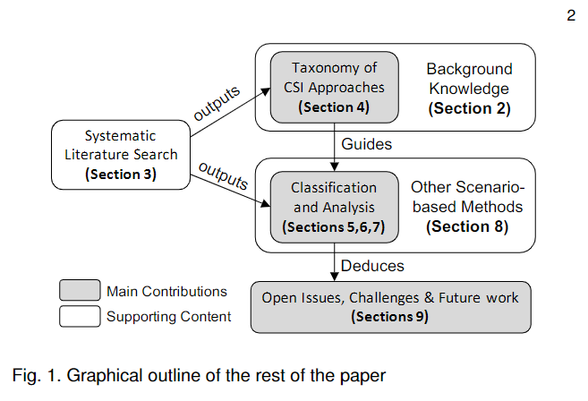
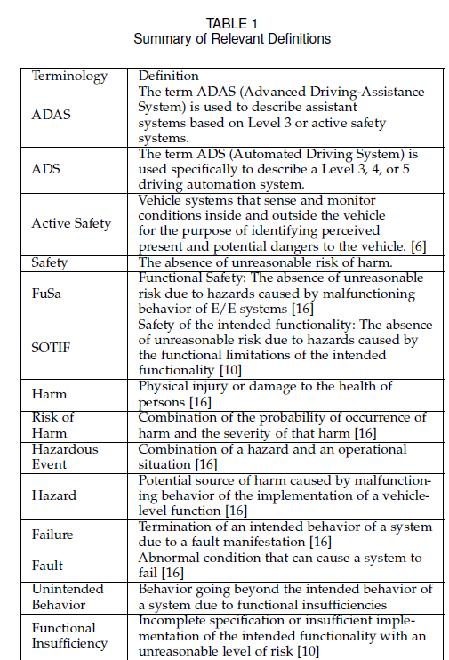
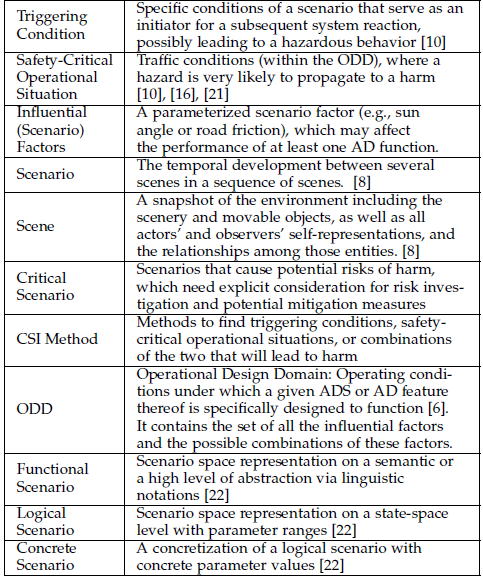
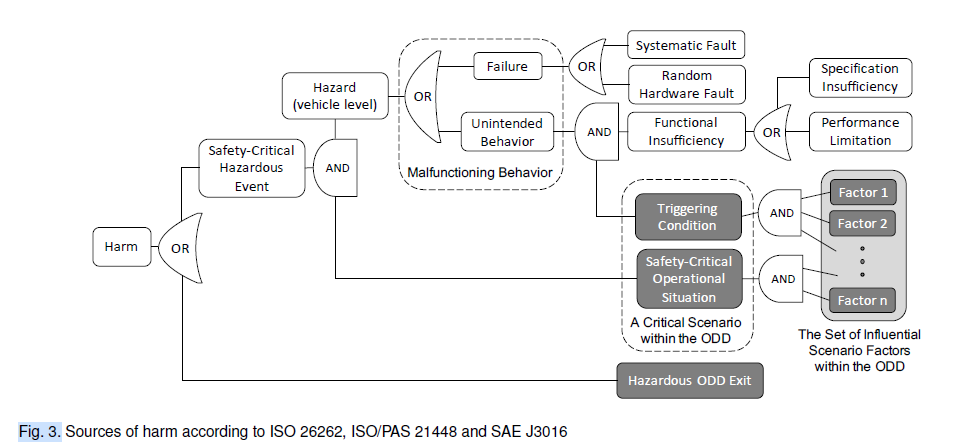
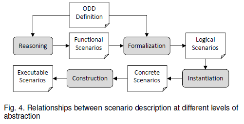
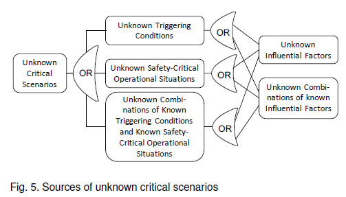
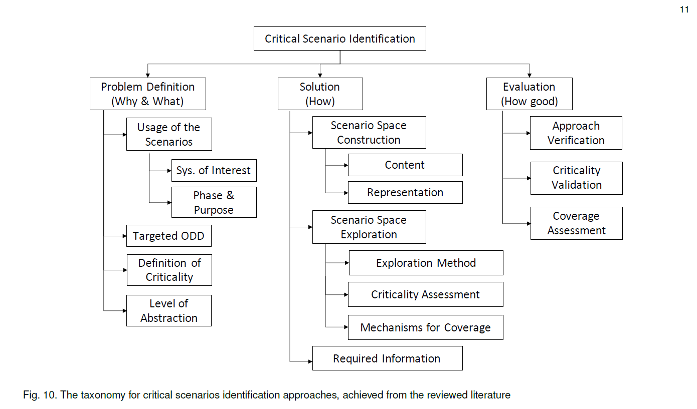

# Finding Critical Scenarios for Automated Driving Systems : A Systematic Mapping Study

[pdf](../reference_summary/Finding_Critical_Scenarios_for_Automated_Driving_Systems_A_Systematic_Mapping_Study.pdf)

doi : 10.1109/TSE.2022.3170122

[다른 공유사항](finding_critical_scenario_공유할만한거.md)

## Index terms 

Critical Scenario, Automated Driving, Systematic Mapping Study

## Abstract

- 요약
  - identificaion of scenario가 중요해졌다. 특히 고려하지 않으면 큰 위험을 초래하는 시나리오에 대해서
  - critical scenario는 safety case를 design, verification, validation 할 때 노력과 기초를 뒷받침한다.
  - 우리의 기여는 다음과 같다
    - critical scenario identification method들의 comprehensive taxonomy
    - critical scenario identification하는 연구 중 가장 주목받는 연구들의 overview
    - 추후 연구가 다뤄야 할 공유된 이슈와 방향들
  - 제공된 taxonomy는 세 가지 관점을 포함하고 있다.   problem definition(the why), the solution(the methods to derive scenarios), and the assessment of the established scenarios
  - 여기에 더해, 우리는 coverage, practicability, scenario space explosion에 관련된 관점들에 대한 open research issue들을 discuss했다.

- 모르는 단어
  - systematic mapping : A systematic mapping study is a systematic and comprehensive approach to mapping and reviewing the available literature in a specific research field. It is often used as a preliminary step for conducting a systematic review or a meta-analysis.(chatGPT)
  - impose : to force someone to accept something, especially a belief or way of living.
  - verification과 validation의 차이 : verification은 잘 만들어졌는지를 검증하는 것이고 validation은 올바른 제품이 나왔는지를 검증하는 것이다. (chatGPT)
  - comprehensive taxonomy : A comprehensive taxonomy is a hierarchical classification system that provides a systematic and organized way of categorizing and organizing information or objects into distinct groups or categories based on their characteristics, features, or attributes.(chatGPT)
  - state-of-the-art : highest level of development or the most advanced stage in a particular field or technology.(chatGPT)
  - encompass : to include different types of things.
  - assessment : Assessment is the process of evaluating or measuring the performance, achievement, or qualities of an individual, system, or organization.

## Introduction

- 요약
  - 자율주행은 현재진행형인 기술적 패러다임 전환이지만, 그 복잡성이 큰 규모의 어려운 사회적, 기술적 도전점들을 만들어냈다.
  - 기존 검증 방법으로는 ADS(Automated Driving System) 또는 ADAS(Advanced Driving-Assistance System)의 검증이 힘들다. 이는 virtual evaluation, verification에 강한 관심을 불러왔다. 이는 다음과 같은 질문을 제시한다.
    - simulation environment와 선택한 test가 있다 했을 때, 어떻게 앞의 둘을 만들어내고, 어떻게 안전성 분석의 범위와 완전성을 판단할 수 있는가?
  - 통상적으로 ADS가 마주칠 수 있는 잠재적으로 무한한 상황들(알려지지 않은 점들과 확실하지 않은 점들)을 제한하는 방법은 Operation Design Domain을 제한하는 방법이었다. 장기적으로는 올바른 방법이지만 단기적으로는 mixed-mode traffic과 자율주행의 복잡성, 어느정도의 위험을 감수할 수 있는가에 대한 동의 등 단기적인 관점으로는 달성하기 어렵다.
  - 이때문에 scenario-based approach들이 큰 관심을 받는 것은 놀라운 일이 아니다.
  - 이 분야는 scenario와 ODD 모델링, exchange format, scenario generation 방법, scenario space 탐험, scenario catalog, 표준, 가이드라인 등을 포함하는 연구, 표준화, 공학에서 매우 활성화되있다.
  - 우리는 연구 중 scenario와 critical scenario를 추론하는 다양한 접근법이 있다는 것을 발견했지만 이를 아우르는 survey를 찾지 못했다.
  - 그래서 우리는 ADS와 ADAS를 위한 Critical Scenario Identification(CSI) 방법에 대한 systematic mapping study를 하게 되었다. 우리의 문헌 리뷰는 ADS와 ADAS의 개발을 지원하기 위한 critical scenario를 찾는 접근법에 집중했다. 주요한 기여는 다음과 같다.
    - comprehensive taxonomy of CSI methods
    - taxonomy에 기초한 CSI method들의 소개
    - 추후 연구를 위한 이슈들과 방향
  - paper는 다음과 같이 이루어져있다.
  - 
    
- 모르는 단어
  - therein : in or into a particular place, thing, etc.
  - pose : to cause something, especially a problem or difficulty
  - formidable : causing you to have fear or respect for something or someone because that thing or person is large, powerful, or difficult
  - reasoning : 추론
  - reason : 동사로서는 >> to try to understand and to make judgments based on practical facts.
  - operation domain design : Operation domain design refers to the process of defining and specifying the operational environment, conditions, and constraints for a system or device. In the context of autonomous vehicles, operation domain design refers to the process of defining the conditions and constraints under which autonomous vehicles will operate, including the types of roads and environments they will encounter, the weather conditions they will need to handle, the regulations and laws they will need to comply with, and the range of vehicle and sensor configurations they will encounter.(chatGPT)

## 2 key terminology and related surveys

- 읽으면서 정리하는 공간
  - functional scenario는 말로써 기술된 시나리오고, logical scenario는 functional scenario를 formalization해서 나온다. logical scenario는 여러개의 parameter를 가지고 있고 이들은 각각 그들만의 value range를 가지고 있다.
  - 이 논문에서 사용되는 용어들을 정리해놓은 TABLE 1    
  - 피해(harm)의 잠재적 요소를 다룬 figure 3   
  - 서로 다른 추상화 레벨에 따른 시나리오 사이의 관계를 나타내는 figure 4   
  - unknown critical scenario들이 나올 수 있는 곳을 표현한 figure 5   

- 모르는 단어
  - facilitate : to make something possible or easier
  - tolerate : to deal with something unpleasant or annoying, or to continue existing despite bad or difficult conditions
  - relevant : connected with what is happening or being discussed
  - conform : to behave according to a group's usual standards and expectations, or to operate according to a rule.
  - semantic : connected with the meanings of words
  - scenario space : Scenario space refers to the set of all possible scenarios or situations that a system or device may encounter or need to address.(chatGPT)
  - state-space : In the context of autonomous vehicles, state-space level can refer to the level of detail or abstraction at which the behavior and performance of an autonomous vehicle system is modeled. For example, a high-level state-space model may represent the overall behavior of an autonomous vehicle system using abstract variables and relationships, while a low-level state-space model may represent the system using detailed variables and relationships that capture the underlying physical processes and interactions.(chatGPT)
  - denote : to represent something
  - formalization : Formalization refers to the process of representing a system, concept, or idea in a precise, unambiguous, and well-defined manner, often using mathematical or logical symbols and techniques.(chatGPT)
  - instantiate : to represent or be an example of something
  - relative : 상대적인
  - elicitation : the process of getting or producing something, especially informaiton or a reaction
  
## 3 Literature Review Methodology

이거는 굳이 안읽어도 될 듯

## 4 Overview Of the Taxonomy

- 읽으면서 생각 정리
  - taxonomy for critical scenarios identificaion approaches   
  - 
- 모르는 단어 
  - surrogate : replacing someone else or used instead of something else
  - surrogate measure : A surrogate measure, also known as an indirect measure or proxy measure, is a substitute or stand-in for a primary measure that is difficult or impossible to directly observe or quantify. Surrogate measures are used to infer the value or presence of the primary measure, based on the relationship between the surrogate measure and the primary measure.
  
## 9 Discussion

- 읽으면서 생각 정리
  - 
- 모르는 단어